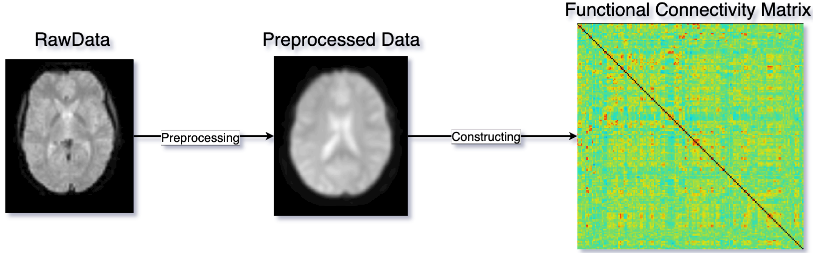

# BraGCL-Brain Graph Contrastive Learning Framework
The paper of WSDM 2024 Demo: **An Interpretable Brain Graph Contrastive Learning Framework for Brain Disease Analysis**

# Introduction
We propose an interpretable brain graph contrastive learning framework that aims to learn brain graph representations from insufficient label data for disease prediction and pathogenic analysis. Our framework consists of two key designs: We first use the controllable data augmentation strategy to perturb unimportant structures and attribute features according to node and edge importance scores. Then, considering that the difference between healthy control and patient brain graphs is small, we introduce hard negative sample evaluation to weight negative samples of the contrastive loss, which can learn more discriminative brain graph representations. More importantly, our method can observe salient brain regions and connections to explain prediction results. We conducted disease prediction and interpretable analysis experiments on three publicly available neuroimaging datasets to demonstrate the effectiveness of our framework.

# Framework


# Implementation
## Brain Graph Construction
Given the neuroimaging of one brain disorder, we first preprocess these neuroimaging according to the process described by <a href="https://github.com/HennyJie/BrainGB">[BrainGB]</a>. Then, we generate the connectivity matrix, such as the functional connectivity matrix of fMRI and the structural connectivity matrix of DTI. Finally, we construct the adjacent matrix via the K-NN algorithm.


### dataset
In this project, three datasets have been evaluated, including `HIV`, `BP` and `ABIDE`.
- **HIV** and *BP* are private datasets that can not be accessed without authorization.
- **ABIDE** is a public dataset that could be downloaded from <a href="https://nilearn.github.io/stable/modules/generated/nilearn.datasets.fetch_abide_pcp.html#nilearn.datasets.fetch_abide_pcp">[Nilearn]</a>

## Pipeline
### 1.Data Preparation
The input of neuroimaging data, such as fMRI and DTI, is first preprocessed and they are modeled into brain graphs based on the above construction process.
### 2.Model Training
BraGCL first performs the controllable data augmentation strategy to perturb unimportant structures and attribute features according to node and edge importance scores, so that the input brain graph will be generated two different views of brain graphs. Secondly, BraGCL conducts the optimization of contrastive loss based on hard negative samples weight to enhance the ability of discriminative brain graph representations learning. 
### 3.Model Evaluation
After the unsupervised model pre-training above, we utilize brain graph representations obtained by the pre-trained model above to predict disease and identify salient brain regions and connections.

# Experiment
## Performance Contrast 
The proposed method(BraGCL) outperforms all baseline methods on three datasets.

<font color=#0099ff>Note:</font> PreGCN is designed by us to contrast the performance of our framework with the pre-training model. It contains three components: 1 MLP layer(unified input dimension of GNN), 2-GCN layers, and 1-MLP layer(classification). `PPMI` has been used to pre-train the model, and `HIV`, `BP`, and `ABIDE` are used to fine-tune the model respectively.  
<font color=#0099ff>Note:</font>: `PPMI` could be downloaded from <a herf="https://www.ppmi-info.org/">PPMI</a>  

## Brain Disorder Analysis
Visualizing salient brain regions and connections for different brain disorders.


# Running
## Requirement
The framework needs the following dependencies:
```
torch~=1.10.2
numpy~=1.22.2
scikit-learn~=1.0.2
scipy~=1.7.3
pandas~=1.4.1
tqdm~=4.62.3
torch-geometric~=2.0.3
torch-cluster 1.5.9
faiss-cpu 1.7.2
```
## Run
To run our model on any of the datasets in our paper, simply run:
```
python main.py --dataset =<dataset name> --modality=<fmri/dti>
```
`--dataset` is the name of the dataset(`HIV`, `BP` are private datasets, `ABIDE` is a public dataset that could be used for everyone)
`--modality` is the type of data, selecting from `fmri` and `dti`  
Please place the dataset files in the `data/` folder under the root folder  
